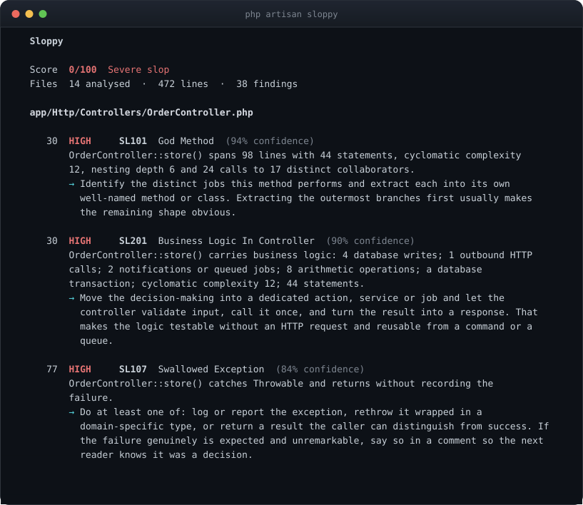
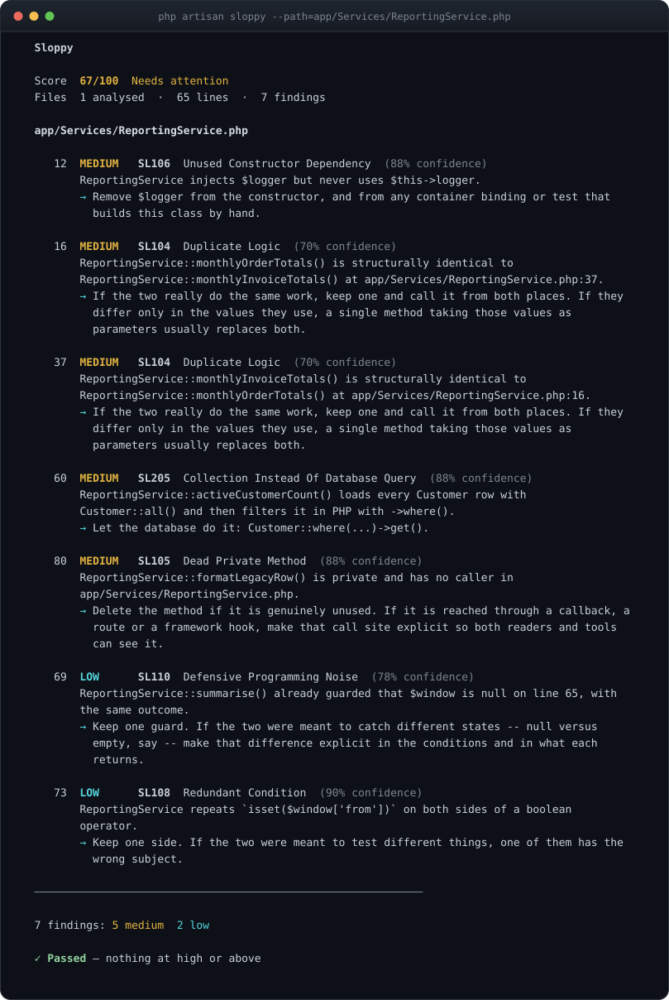
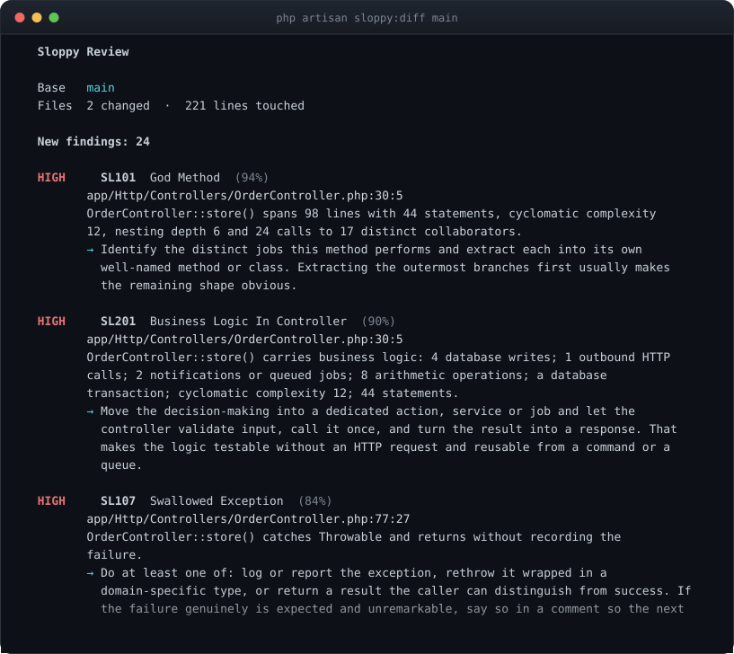
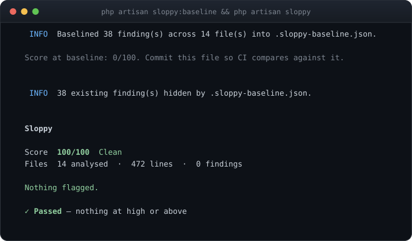
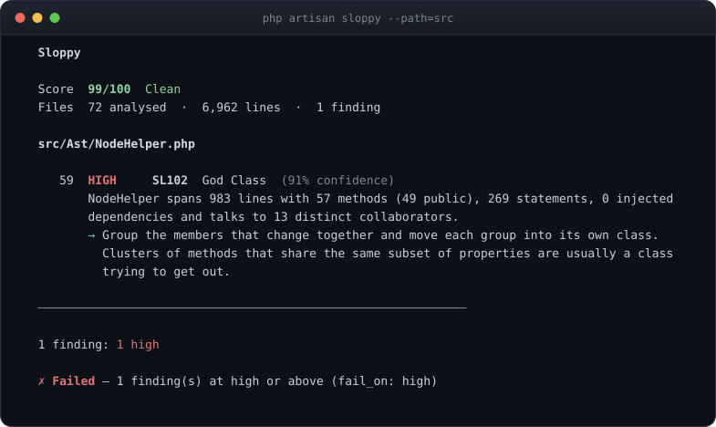
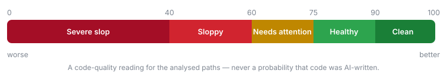

<p align="center">
  <picture>
    <source media="(prefers-color-scheme: dark)" srcset=".github/assets/logo-dark.svg">
    
  </picture>
</p>

<p align="center">
  <b>Static analysis for the code-quality patterns AI coding agents leave behind.</b><br>
  Runs on any PHP project — 25 rules, plus a Laravel set that knows Eloquent, controllers and queues.
  Hands the mechanical fixes to Rector and Pint, fails your Pest suite on new debt, annotates the
  pull request, and teaches the agent through CLAUDE.md and MCP.<br>
  Deterministic and local — no model, no API key, no network.
</p>

<p align="center">
  <a href="https://github.com/heyosseus/sloppy/actions/workflows/tests.yml"></a>
  <a href="https://packagist.org/packages/heyosseus/sloppy"></a>
  <a href="https://packagist.org/packages/heyosseus/sloppy"></a>
  
  <a href="LICENSE.md"></a>
</p>

<p align="center">
  
</p>

Sloppy reads your PHP with a real parser and reports the shapes that turn into
maintenance cost: god methods, swallowed exceptions, likely N+1 queries,
business logic in controllers, abstractions that never earned their keep.

It ships 25 rules, a git-diff review mode and a baseline for existing
projects; a CI command that reads your pipeline instead of asking you to
describe it, with an official GitHub Action and a GitLab template; an
automated fix pass that hands the mechanical findings to Rector and the
formatting to Pint; a Pest plugin, so new debt fails in the same red-green
loop as everything else; and, for the agents writing the code, a generated
ruleset for `CLAUDE.md` and its equivalents plus an MCP server they can check
their own work against.

Every screenshot on this page is real output from the command in its caption.

## It is not an AI detector

Nobody can reliably prove authorship from source code, and a tool that claimed
to would be selling you a coin flip with a progress bar. Sloppy never guesses
who or what wrote a line. It detects **slop** — patterns that correlate with
fast, unreviewed output and with technical debt generally. A 200-line
controller action that writes to four tables, calls a payment API and swallows
a `Throwable` is a problem whether a person, an agent or a pair of them wrote
it at 3am.

So every number is about the *code*, never about its author:

| Sloppy says | It means | It does **not** mean |
| --- | --- | --- |
| `Confidence: 88%` | How sure the analyser is that the pattern it describes is really present | Any probability that the code was AI-generated |
| `Score: 67/100` | A code-quality risk measure for the analysed paths | "67% of this code is AI-generated" |
| `SL107 Swallowed Exception` | This catch block does nothing observable with the failure | An accusation about who wrote it |

Sloppy is deterministic and local. Your source never leaves the machine, and
the same code always produces the same report — which is what makes it usable
as a gate.

## Install

```bash
composer require --dev heyosseus/sloppy

php artisan sloppy          # Laravel
vendor/bin/sloppy           # any PHP project
```

The service provider is discovered automatically. Publish the config when you
want to tune it:

```bash
php artisan vendor:publish --tag=sloppy-config
```

### Or without adding a dependency

Deciding whether a tool is worth a `composer.json` entry is easier once you
have seen what it says about your code. Two ways to run it against a project
that has never heard of it:

```bash
# Once per machine, for every project on it
composer global require heyosseus/sloppy
sloppy                                    # run it from anywhere inside a project

# Or a single file, no Composer resolution at all
curl -L -o sloppy.phar https://github.com/heyosseus/sloppy/releases/latest/download/sloppy.phar
chmod +x sloppy.phar
./sloppy.phar
```

Both work with no configuration file. Sloppy finds the project by walking up to
the nearest `composer.json`, and analyses the PSR-4 source roots declared there
when there is no `config/sloppy.php` to say otherwise — so `src/` on a
framework-free project and `app/` on a Laravel one are both found on their own.
Pass `--project` when the directory it picked is not the one you meant.

Everything works this way except the `php artisan sloppy:*` commands
themselves, which need the package installed in the project. `sloppy fix` still
drives Rector and Pint, because it resolves them from the *analysed* project's
`vendor/bin` rather than its own.

Each release attaches `sloppy.phar.sha256` alongside the binary, if you want to
check it:

```bash
curl -L -o sloppy.phar.sha256 https://github.com/heyosseus/sloppy/releases/latest/download/sloppy.phar.sha256
sha256sum -c sloppy.phar.sha256
```

Requirements: **PHP 8.3+**. Laravel 12 or 13 for the Artisan commands and the
`SL2xx` rules; everything else runs anywhere.

## Which command do I want?

```bash
php artisan sloppy:help      # or: vendor/bin/sloppy guide
```

Eleven commands, and the moment each one belongs to. Both names run the same
code, so use whichever your project has.

| Every day | | |
|---|---|---|
| `sloppy` | `sloppy scan` | Analyse the project and rank what is worth reading first |
| `sloppy:diff` | `sloppy diff` | Report what a change introduced, against a git revision |
| `sloppy:review` | `sloppy review` | The same change, ordered by risk rather than by file |
| `sloppy:baseline` | `sloppy baseline` | Accept what is already there, so only new findings fail |
| `sloppy:watch` | `sloppy watch` | Keep the score on screen, redrawing as files change |
| `sloppy:help` | `sloppy guide` | This list |
| **In a pipeline** | | |
| `sloppy:ci` | `sloppy ci` | Analyse a change the way the surrounding CI system reports it |
| `sloppy:fix` | `sloppy fix` | Hand the fixable findings to Rector, then format with Pint |
| `sloppy:health` | `sloppy health` | The score and what is dragging it down, from a cached snapshot |
| **For agents** | | |
| `sloppy:rules` | `sloppy rules` | Write this project's rules into `CLAUDE.md`, `AGENTS.md` and friends |
| `sloppy:mcp` | `sloppy mcp` | Serve scan, diff, rules and health over MCP |

For one command's options, `sloppy help <command>` or
`php artisan sloppy:<command> --help`.

## Contents

- [Which command do I want?](#which-command-do-i-want) · [Scan a project](#scan-a-project) · [Anatomy of a finding](#anatomy-of-a-finding)
- [Review a change](#review-a-change) · [Adopt on an existing codebase](#adopt-on-an-existing-codebase)
- [Does it just complain about everything?](#does-it-just-complain-about-everything)
- [Slop score](#slop-score) · [Severity and confidence](#severity-and-confidence)
- [Rules](#rules) · [Configuration](#configuration) · [Custom rules](#custom-rules)
- [What to read first](#what-to-read-first) · [Risk](#risk)
- [JSON output](#json-output) · [Editors and code scanning](#editors-and-code-scanning)
- [Exit codes](#exit-codes) · [CI](#ci) · [GitHub Action](#github-action) · [GitLab CI](#gitlab-ci)
- [Fix what can be fixed](#fix-what-can-be-fixed) · [What it can fix](#what-it-can-fix-and-what-it-will-not-pretend-to) · [In your test suite](#in-your-test-suite)
- [Watch while you work](#watch-while-you-work) · [Filament and NativePHP](#filament-and-nativephp) · [Rules for coding agents](#rules-for-coding-agents) · [Custom rules for agents](#your-custom-rules-teach-the-agents-too) · [MCP server](#mcp-server)
- [What Sloppy is not](#what-sloppy-is-not) · [False positives](#false-positives)

## Scan a project

```bash
php artisan sloppy                  # the configured paths
php artisan sloppy --path=app/Services
php artisan sloppy --rule=SL101 --rule=SL107
php artisan sloppy --min-confidence=80
php artisan sloppy --explain        # include each rule's "why this matters"
```

The screenshot at the top of this page is that command run against a small
application written badly on purpose. It ships as `tests/Fixtures/Sloppy`, so
you can reproduce it.

### Anatomy of a finding

One file, seven findings, the whole report:



Every finding carries the same five things: **where** it is, **what** was
measured, **how sure** the analyser is, **why** the pattern is often a problem,
and **what to do** about it. The last one is the point — a finding you cannot
act on is noise with a line number.

## Review a change

The most useful command if you work with coding agents:

```bash
php artisan sloppy:diff             # working tree vs HEAD
php artisan sloppy:diff HEAD~1      # vs the previous commit
php artisan sloppy:diff main        # everything this branch changed
```

It separates what your change *introduced* from what it merely *inherited*, and
only new findings can fail the build.



Three things worth knowing about how it works:

- **It reviews the working tree, not just commits.** Uncommitted and untracked
  files are included, so an agent's new class is reviewed before it is
  committed rather than after.
- **Findings are matched by fingerprint, not by line number.** Adding an import
  at the top of a file does not turn every existing finding in it into a new
  one.
- **Cross-file rules still see the whole project.** Rules only *run* on changed
  files, but the project index is built from everything, so `SL303` can still
  tell that an interface has exactly one implementation in a file the diff
  never touched.

## Adopt on an existing codebase

Turning Sloppy on for the first time should not mean fixing everything first.
Record what is there today, commit the file, and gate on what comes next:

```bash
php artisan sloppy:baseline
```



Baseline entries are keyed on rule, file and a rule-supplied fingerprint —
usually a class and member name — and deliberately **not** on line numbers, so
a baseline survives ordinary editing. If a finding occurs more often than the
baseline recorded, the extra occurrences are new.

`--force` replaces an existing baseline; `--rule=` baselines only some rules.

## Does it just complain about everything?

That is the failure mode of every analyser, so Sloppy runs its whole rule set
over its own source in CI:



One finding, and it is a real one: `NodeHelper` is a large class. Splitting it
into five so that rules import three of them to ask three questions would be
exactly the ceremony this package exists to discourage, so the decision is
recorded in `tests/Feature/SelfCheckTest.php` with its reasoning — and that
test fails on any *new* finding about Sloppy's own code. Four others it found
were genuine, and they were fixed.

The other half of the answer is `tests/Fixtures/Good`: deliberately ordinary
Laravel code, with a test asserting that all 25 rules report **zero** findings
on it at a score of 100.

## What to read first

`sloppy:diff` answers *did this change make it worse?* `sloppy:review` answers
the question you have immediately afterwards: **of everything this change
touched, what deserves reading?**

```bash
vendor/bin/sloppy review origin/main
php artisan sloppy:review origin/main
```

```
  Sloppy review

  161 file(s) changed, 12,198 lines  ·  score 5 → 12 (+7)

  Read in this order
    1. app/Actions/Product/CloneProductToTenantAction.php   risk 70.5
         new SL111 Copy-Paste Drift  (76%, risk 9.9, in hunk)
         new SL102 God Class  (73%, risk 9.5, in hunk)
         new SL111 Copy-Paste Drift  (68%, risk 8.8, in hunk)
         new SL204 Query Inside Loop  (84%, risk 4.4, in hunk)
         and 9 more in this file, 2 x SL104, 7 x SL204
    2. app/Filament/Imports/B2bCatalogImporter.php   risk 48.0
         new SL102 God Class  (91%, risk 11.8, in hunk)
         new SL101 God Method  (76%, risk 9.9, in hunk)

  Skim
    4 file(s), risk under 5
      app/Support/TenantFrontend.php  risk 3.4

  No attention needed
    132 file(s) changed with no findings

  Resolved by this change
    3 finding(s) no longer reported
      2 x SL101 God Method
      1 x SL204 Query Inside Loop
```

Three tiers, so you know where to stop. Same analysis, same score and the same
exit code as `sloppy:diff` — only the presentation differs, so adopting the
reading order changes no build outcome.

**`in hunk` is the part no other tool can do.** A god method your change
*created* and a god method it merely stood next to are not the same finding.
Telling them apart needs the diff's hunks at rule time, and nothing else in
this space has them.

## Risk

Risk and the slop score answer different questions, and conflating them leads a
team to chase the wrong one.

| | Slop score | Risk |
| --- | --- | --- |
| Question | How is this codebase? | What should I read next? |
| Normalised | Yes, by size | No, absolute |
| Aware of your change | No | Yes |
| Moves a baseline | Yes | Never |

```
risk = severity_weight × (confidence / 100) × novelty × proximity × reach × exposure

reach     = 1 + log10(1 + blast_radius) × reach_weight
novelty   = new 1.0 | inherited 0.25
proximity = inside a changed hunk 1.0 | elsewhere in a touched file 0.3
exposure  = 1 + (1 − coverage) × exposure_weight | 1.0 when no coverage report
```

Every factor defaults to 1.0 when it cannot be measured, which is what makes
the model safe to extend: a project with no coverage report ranks exactly as it
did before `exposure` existed.

**Reach is logarithmic on purpose.** A class with two hundred callers is not
two hundred times more urgent than one with a single caller; the tenth caller
costs less new attention than the first. One usage yields 1.30, ten yields
2.04, a hundred yields 3.00 — a 2.3× spread across two orders of magnitude,
which is roughly the spread a reviewer actually feels.

**A file's risk is the raw sum of its findings, not their density.** A file
with twelve findings should be read before a file with one, even if it is
longer. Density is the right measure for quality and the score already provides
it; total is the right measure for attention.

Every weight lives under `sloppy.risk` and every one is documented in
`config/sloppy.php`. Set `reach_weight` to `0.0` to rank on severity and
confidence alone.

### Show me the arithmetic

Add `--explain-risk` to any command and every derived number prints its own
working:

```bash
vendor/bin/sloppy scan --explain-risk
```

```
    108  HIGH     SL102  God Class  (91% confidence)
         NodeHelper spans 1021 lines with 59 methods…
         → Group the members that change together…
         risk  10.0 (high) × 0.91 (confidence) × 1.00 (novelty unknown) × 1.00 (whole file) × 2.45 (27 usages) = 22.27
```

A tool that weights findings owes you its weights. A number you can watch it
derive is not a magic number.

## Slop score

A single deterministic number for the analysed paths:

<p align="center">
  
</p>

```text
penalty  = Σ  weight(severity) × confidence / 100
units    = max(1, analysedLines / lines_per_unit)
density  = penalty / units
coverage = min(1, Σ affectedLines / analysedLines)
score    = 100 − min(100, density × penalty_multiplier × (1 + coverage))
```

- Step 1 makes a finding we are half sure about cost half as much.
- Step 2 normalises by codebase size, so a large application is not punished
  merely for being large.
- Step 4 doubles the penalty when findings blanket the codebase and barely
  moves it when they are localised.

Default weights are `critical: 20`, `high: 10`, `medium: 4`, `low: 1.5`,
`info: 0.5`. Weights, the multiplier, `lines_per_unit` and the band thresholds
are all configurable under `sloppy.score`. Same input, same score — always.

Because the score is a density, a small codebase full of findings bottoms out
quickly: the 472-line demo application in the first screenshot scores 0. That
is the arithmetic working, not a verdict on 472 lines of anything.

## Severity and confidence

They answer different questions, and both appear on every finding.

**Severity** — how much this matters if it is real. `critical`, `high`,
`medium`, `low`, `info`. Set by the rule, overridable per rule in config. This
is what `fail_on` compares against.

**Confidence** — how sure the analyser is that the pattern it describes is
actually present, 0–100. A 300-line method is a measurement, so confidence is
high. A possible N+1 depends on eager loading the analyser may not be able to
see, so confidence is lower. Abstraction inflation is a heuristic, so it never
reports above 78.

No rule ever reports 100% confidence. These are heuristics, and a heuristic
that claims certainty is lying.

## Rules

25 rules ship. Every one has tests proving both that it fires on the pattern
and that it stays quiet on ordinary Laravel code.

### PHP and general

| ID | Rule | Severity | Category | What it looks for |
| --- | --- | --- | --- | --- |
| `SL101` | God Method | High | Complexity | Methods that are excessively long, branchy or chatty across several independent measurements. |
| `SL102` | God Class | High | Complexity | Classes that are large across several dimensions at once: size, method count, injected dependencies and the number of collaborators they talk to. |
| `SL103` | Excessive Nesting | Medium | Complexity | Methods whose conditionals, loops and try blocks nest deeper than the configured limit. |
| `SL104` | Duplicate Logic | Medium | Duplication | Methods whose bodies are structurally identical to another method in the project. |
| `SL105` | Dead Private Method | Medium | Dead code | Private methods with no visible caller anywhere in the declaring file. |
| `SL106` | Unused Constructor Dependency | Medium | Dependencies | Constructor-injected dependencies that are never read anywhere in the class. |
| `SL107` | Swallowed Exception | High | Error handling | Catch blocks that neither rethrow, report, log nor otherwise react to the failure they caught. |
| `SL108` | Redundant Condition | Low | Readability | Conditions re-tested immediately inside themselves, repeated within one if/elseif chain, duplicated across a boolean operator, or written as a literal true/false. |
| `SL109` | Narrative Comment | Low | Readability | Short comments whose every meaningful word already appears in the statement directly below them. |
| `SL110` | Defensive Programming Noise | Low | Readability | A method that guards the same subject the same way twice, with the same outcome and no reassignment in between. |
| `SL111` | Copy-Paste Drift | High | Duplication | A method body nearly identical to a sibling's, where the one difference looks like an unfinished copy rather than a deliberate variation -- a missing guard, a flipped comparison, the wrong class constructed. Heuristic: the majority is more likely to be right, not automatically right. |

### Laravel

| ID | Rule | Severity | Category | What it looks for |
| --- | --- | --- | --- | --- |
| `SL201` | Business Logic In Controller | High | Laravel | Controller actions that combine several business concerns: database writes, calculations, transactions, outbound calls and branching. |
| `SL202` | Inline Validation | Low | Laravel | Large inline validation rule sets inside controllers, where a FormRequest would carry them better. |
| `SL203` | Possible N+1 | Medium | Performance | Relationship access inside a loop where the iterated collection does not appear to eager load that relation. |
| `SL204` | Query Inside Loop | Medium | Performance | Query builder or Eloquent queries executed inside a loop. |
| `SL205` | Collection Instead Of Database Query | Medium | Performance | A full table load followed immediately by a collection operation the database could have performed. |
| `SL206` | Excessive Controller Dependencies | Medium | Dependencies | Controllers whose constructor injects more collaborators than the configured limit. |
| `SL207` | Excessive Service Dependencies | Medium | Dependencies | Service, action and manager classes whose constructor injects more collaborators than the configured limit. |
| `SL208` | Direct External API Call | Medium | Laravel | Outbound HTTP requests made directly from controllers, models, form requests or middleware. |
| `SL209` | Model Doing Too Much | Medium | Laravel | Eloquent models that make outbound calls, dispatch notifications or jobs, or contain long business workflows. |
| `SL210` | Suspicious `Model::all()` | Medium | Performance | `Model::all()` whose result is iterated in the same method, or which is called from inside a loop. |

### Architecture

These three are **advisory**. They report that an abstraction is not earning
its keep *for the current usage*, which is a judgement about today's code and
not a rule against repositories or interfaces.

| ID | Rule | Severity | Category | What it looks for |
| --- | --- | --- | --- | --- |
| `SL301` | Abstraction Inflation | Medium | Architecture | Concepts wrapped in several layers where at least one layer is trivial, singly implemented or singly used. |
| `SL302` | Empty Wrapper Class | Medium | Architecture | Classes whose public methods almost all forward their arguments unchanged to a single injected collaborator. |
| `SL303` | Single-Use Abstraction | Low | Architecture | Small interfaces and abstract classes that have exactly one implementation and at most one calling file. Ones that declare nothing at all — Laravel's scaffolded `Controller`, a marker interface — are not reported: there is no signature to duplicate. |

### Suppression

An analyser being silenced is not a style question. These two are about the
moment somebody decided to stop being told about a problem rather than fix it.

| ID | Rule | Severity | Category | What it looks for |
| --- | --- | --- | --- | --- |
| `SL501` | Unexplained Suppression | Medium | Suppression | `@phpstan-ignore`, `@psalm-suppress`, `@mago-expect`, `@noinspection`, `phpcs:ignore` or `@SuppressWarnings` written with no reason after it. Not suppression *density*: a defended suppression is a reviewed decision, and flagging those would train people to delete the explanation rather than the ignore. |
| `SL502` | Baseline Growth | Medium | Suppression | Entries this change added to `phpstan-baseline.neon` or `psalm-baseline.xml`. Diff mode only — "grew" needs two revisions. Compared per source path, so regenerating a baseline reports nothing. |

## Signals from the tools you already run

Sloppy never runs PHPStan, Psalm, Pint or Rector. It reads what they leave
behind and treats it as evidence about a *change* — which is the one thing
those tools cannot do for each other, because none of them knows what changed.

Two rules decide where a signal is allowed to go, and together they are why the
numbers stay comparable:

| | Tracked in git | Not tracked |
| --- | --- | --- |
| Example | `phpstan-baseline.neon` | `build/logs/clover.xml` |
| Same answer on a fresh CI clone? | Yes | No — it exists only after a test run |
| May move the **score**? | Only if also computable from the tree alone | Never |
| May move **risk**? | Yes | Yes |

> **The score is a function of the tree alone.** Anything that needs a second
> revision to compute may be reported and ranked, but never scored.

So `SL501` moves the score — the suppression is sitting there in the file.
`SL502` does not: it exists only relative to a base revision, and scoring it
would make `sloppy scan` and `sloppy diff main` report different scores for the
same working tree. It still counts against `--fail-on`, because a build may
legitimately refuse a change that silenced three errors.

### Coverage

Point Sloppy at a clover or cobertura report and a changed file your tests
never execute rises in the reading order:

```bash
sloppy review main --coverage=build/logs/clover.xml --explain-risk
```

```
4.0 (medium) × 0.85 (confidence) × 1.00 (new) × 1.00 (in hunk) × 1.00 (reach unmeasured) × 1.50 (untested) = 5.10
```

The path can also come from `sloppy.risk.coverage` — it lives in the risk block
because risk is the only thing it feeds — and with neither set Sloppy checks
`build/logs/clover.xml`, `coverage.xml`, `build/coverage/clover.xml`,
`coverage/clover.xml` and `build/logs/cobertura.xml`. Clover and Cobertura are
told apart by content, because CI configurations name these anything at all.

The baseline files `SL502` watches are a rule option, beside `SL501`'s
suppression vocabulary:

```php
'rules' => [
    'SL502' => ['files' => ['phpstan-baseline.neon', 'psalm-baseline.xml']],
],
```

Coverage **never** changes the slop score. A file nobody tested is not a file
with a defect in it; it is a file where a defect would survive, which is a
statement about what to read first.

Coverage reports go stale, and a stale one silently reorders a review. Sloppy
does not guess at that: `sloppy health` and `--explain-risk` print the report's
path and the date it was written, and leave the judgement to you. A staleness
heuristic would be a number that cannot show its arithmetic, which is the one
thing every number in this package can do.

`ext-xml` is suggested, not required. Without it coverage is skipped and
nothing else changes.

## Configuration

Everything lives in `config/sloppy.php`. There is deliberately no second
configuration format to keep in sync.

```php
return [
    'enabled' => env('SLOPPY_ENABLED', true),

    'paths' => ['app'],

    'exclude' => [
        'vendor', 'storage', 'bootstrap/cache', 'node_modules', 'public',
        'database/migrations', 'database/factories', 'database/seeders',
        '*.blade.php',
    ],

    // Lowest severity that fails the command, or null to never fail.
    'fail_on' => 'high',

    // Drop findings below this confidence before reporting anything.
    'min_confidence' => 0,

    'baseline' => '.sloppy-baseline.json',

    'rules' => [
        // Every rule is on unless it says otherwise here.
        'SL109' => ['enabled' => false],

        // Prefer lowering a severity to switching a rule off: the finding
        // stays visible without failing the build.
        'SL301' => ['severity' => 'low'],

        'SL101' => ['max_lines' => 120, 'max_complexity' => 20],
        'SL206' => ['max_dependencies' => 6],
        'SL210' => ['ignore_models' => ['Country', 'Currency', 'Setting']],
    ],
];
```

Exclusions match whole path segments at any depth, so `vendor` excludes both
`vendor/…` and `packages/foo/vendor/…`. Entries containing `*` are matched as
globs.

The published config file documents every option of every rule with its
default. Start by reading that rather than this table.

### Tuning a noisy first run

In order of bluntness:

1. `min_confidence: 75` — keep only findings the analyser is fairly sure about.
2. `'SL109' => ['severity' => 'info']` — keep the finding, stop it mattering.
3. `php artisan sloppy:baseline` — accept today's debt, gate on tomorrow's.
4. `'SL109' => ['enabled' => false]` — last resort.

## JSON output

```bash
php artisan sloppy --format=json
php artisan sloppy:diff --format=json
```

The shape is a published contract. `schema` is bumped when a field changes
meaning; within a schema version keys are only ever added. Findings come out in
the analyser's canonical order, so two runs over the same code produce
byte-identical output that is safe to diff in CI.

**Standard output carries the report and nothing else**, so it pipes:

```bash
vendor/bin/sloppy scan --format=json | jq '.findings[] | select(.severity == "high")'
```

Anything written for the reader rather than for the machine -- the project root
and configuration source, the count of findings a baseline is hiding, progress
-- goes to standard error. In a terminal you see it as usual; in a pipe it stays
out of the way. Redirect it with `2>/dev/null` if you want it gone entirely.

This is the report behind the screenshot above, abridged to one finding:

```json
{
  "schema": 1,
  "tool": "sloppy",
  "score": {
    "value": 67,
    "band": "needs_attention",
    "label": "Needs attention",
    "penalty": 18.68,
    "penalty_density": 18.68
  },
  "summary": {
    "files": 1,
    "lines": 65,
    "findings": 7,
    "by_severity": { "critical": 0, "high": 0, "medium": 5, "low": 2, "info": 0 }
  },
  "findings": [
    {
      "rule": "SL106",
      "name": "Unused Constructor Dependency",
      "category": "dependencies",
      "severity": "medium",
      "confidence": 88,
      "file": "app/Services/ReportingService.php",
      "line": 12,
      "end_line": 12,
      "column": 9,
      "message": "ReportingService injects $logger but never uses $this->logger.",
      "explanation": "An unused dependency still has to be constructed and resolved, and it misleads the next reader about what the class actually needs. ...",
      "suggestion": "Remove $logger from the constructor, and from any container binding or test that builds this class by hand.",
      "fingerprint": "ReportingService::$logger",
      "identity": "a6166b140b3256d6",
      "metrics": { "dependency": "Psr\\Log\\LoggerInterface", "promoted": true }
    }
  ],
  "errors": {}
}
```

`identity` is the stable hash baselines and diff mode match on. `errors` maps
whatever could not be processed to why — a relative path for a file that would
not parse, or `"SL101 in app/Foo.php"` for a rule that threw.

Diff mode returns the same envelope with `mode: "diff"`, a `base`, a
`changed_files` list, `score.base` / `score.current` / `score.delta`, and
findings split into `new`, `existing` and `resolved`.

## Editors and code scanning

Sloppy speaks three formats that put findings where you already look, so it
does not need a dashboard of its own.

| Format | Goes to |
| --- | --- |
| `--format=sarif` | GitHub code scanning, VS Code, JetBrains IDEs |
| `--format=github` | Inline annotations on a pull-request diff |
| `--format=markdown` | A pull-request comment body |

### SARIF

```bash
vendor/bin/sloppy scan --format=sarif > sloppy.sarif
```

SARIF 2.1.0 is what code-scanning tooling already reads, which is the answer
to *why not SonarQube* without running a server. Findings appear in the
Security tab, and in your editor's problems panel, from one file.

GitHub deduplicates findings across runs using `partialFingerprints`, and
Sloppy's finding identity is exactly the right shape for it: a stable hash of
rule, file and a rule-supplied fingerprint that **excludes the line number**,
so adding an import at the top of a file does not resurrect every finding
beneath it or re-notify you about all of them.

```yaml
      - name: Analyse
        run: vendor/bin/sloppy scan --format=sarif --fail-on=never > sloppy.sarif

      - uses: github/codeql-action/upload-sarif@v3
        with:
          sarif_file: sloppy.sarif
```

`--fail-on=never` is deliberate there: let the upload happen, and let code
scanning decide what blocks a merge.

### Inline annotations

```yaml
      - name: Annotate the diff
        run: vendor/bin/sloppy scan --format=github
```

No redirection — the workflow commands are meant to be *seen* by the runner on
standard output, which is why `github` is the one machine-readable format you
do not pipe to a file.

### A pull-request comment

```yaml
      - name: Comment
        run: |
          vendor/bin/sloppy review origin/${{ github.base_ref }}             --format=markdown > review.md
          gh pr comment ${{ github.event.number }} --body-file review.md
        env:
          GH_TOKEN: ${{ secrets.GITHUB_TOKEN }}
```

## Exit codes

| Code | Meaning |
| --- | --- |
| `0` | Analysis completed and nothing breached `fail_on` |
| `1` | Analysis completed and found something at or above `fail_on` |
| `2` | Analysis could not run: bad configuration, no git repository, unreadable baseline |

The distinction between 1 and 2 matters. A pipeline that conflates them either
ignores real findings or fails on a typo in a config file without telling you
which.

## CI

One command, and it works out the rest:

```bash
php artisan sloppy:ci        # or: vendor/bin/sloppy ci
```

`sloppy ci` reads the environment it is running in and does what that
environment wants:

| Where it runs | What it does |
| --- | --- |
| A GitHub pull request | Compares against the target branch and annotates the changed lines |
| A GitHub push | Analyses the whole project |
| GitLab | Writes a Code Quality report GitLab renders in the merge request |
| Anywhere else | Prints the ranked console report |

It also writes the ranked report to the GitHub job summary, and hands the
numbers back as step outputs so a later step can comment, gate a deploy or
publish a badge without running anything twice.

Everything is overridable: `--base`, `--format`, `--report=<file>`,
`--fail-on`, `--scan`, `--no-summary`, `--path`, `--rule`, `--min-confidence`.

## GitHub Action

Three lines of YAML:

```yaml
- name: Run Sloppy Agent Review
  uses: heyosseus/sloppy-action@v1
  with:
    diff-branch: main
```

In full, with the parts you might want:

```yaml
name: sloppy

on: pull_request

permissions:
  contents: read
  pull-requests: read

jobs:
  review:
    runs-on: ubuntu-latest
    steps:
      - uses: actions/checkout@v4

      - id: sloppy
        uses: heyosseus/sloppy-action@v1
        with:
          fail-on: high          # critical, high, medium, low, info or never
          paths: app src         # optional, space separated
          report: sloppy.json    # optional machine-readable copy

      - run: echo "Score ${{ steps.sloppy.outputs.score }} (${{ steps.sloppy.outputs.new-findings }} new)"
```

The action fetches the base branch itself -- `actions/checkout` clones one
commit by default, and diff mode needs the branch the pull request targets, or
it would report inherited findings as if the author had written them.

Inputs: `diff-branch`, `paths`, `rules`, `fail-on`, `min-confidence`, `format`,
`report`, `scan`, `summary`, `working-directory`, `php-version`, `version`.
Outputs: `score`, `score-delta`, `findings`, `new-findings`,
`resolved-findings`, `status`, `mode`.

The action is this repository's own `action.yml`, so
`uses: heyosseus/sloppy@v1` works too if you prefer not to depend on a second
repository.

## GitLab CI

Include the shipped template and the findings appear in the merge request's
Code Quality widget, beside the lines they are about:

```yaml
include:
  - remote: 'https://raw.githubusercontent.com/heyosseus/sloppy/main/resources/ci/gitlab-ci.yml'

variables:
  SLOPPY_FAIL_ON: high
```

The report covers the whole project on purpose: GitLab works out which findings
a merge request introduced by comparing the report against the target branch's,
and handing it a diff would break the comparison it is already doing for you.

## Fix what can be fixed

Sloppy does not rewrite your code. Rector and Pint already do that well, and
what Sloppy knows that they do not is *which* of their rules this project
currently needs:

```bash
php artisan sloppy:fix --dry-run     # show what would change
php artisan sloppy:fix               # rewrite, then format
```

It generates a Rector configuration scoped to the files that actually have
findings, runs it, formats the rewritten files with Pint, and then tells you
what is left:

```
  12 of 31 finding(s) have an automated fix. Wrote rector-sloppy.php.
  rector finished.
  pint finished.
  19 finding(s) need a person: SL101 x4, SL102 x1, SL104 x9, SL111 x5.
  Findings 31 -> 19. Score 68/100 -> 84/100.
```

Scoping matters: the generated configuration lists only the files that have
findings, so a fix pass on a large project does not rewrite the whole of
`app/` to prove a point about six files.

### What it can fix, and what it will not pretend to

Six rules map onto Rector rules that genuinely fix them:

| Rule | Fixed by |
| --- | --- |
| `SL103` Excessive Nesting | `ChangeNestedIfsToEarlyReturn`, `ChangeNestedForeachIfsToEarlyContinue`, `CombineIf` |
| `SL105` Dead Private Method | `RemoveUnusedPrivateMethod` |
| `SL106` Unused Constructor Dependency | `RemoveUnusedConstructorParam`, `RemoveUnusedPromotedProperty`, `RemoveUnusedPrivateProperty` |
| `SL107` Swallowed Exception | `ThrowWithPreviousException`, `RemoveDeadTryCatch` |
| `SL108` Redundant Condition | `RemoveAlwaysTrueIfCondition`, `RemoveAlwaysElse`, `SimplifyIfReturnBool` |
| `SL110` Defensive Programming Noise | `SimplifyIfNotNullReturn`, `RemoveAlwaysTrueIfCondition` |

Rector's `...Rector` class suffix is omitted above for width; the generated
configuration names each class in full.

The rest are left alone on purpose, and the report says why at the point you
would have asked:

| Rule | Why no tool fixes it |
| --- | --- |
| `SL101` God Method | splitting a long method is a design decision, not a rewrite |
| `SL102` God Class | which responsibility leaves the class is a design decision |
| `SL104` Duplicate Logic | the shared code has to be named before it can be extracted |
| `SL109` Narrative Comment | deleting a comment automatically risks deleting the one that mattered |
| `SL111` Copy-Paste Drift | only you know whether the drift between the copies was deliberate |

No automated rewrite splits a god method into the three methods it wanted to
be, and one that tried would produce three worse ones. A fix command that
claimed otherwise would cost you more time than it saved.

### Running it your way

| Flag | What it does |
| --- | --- |
| `--dry-run` | Write nothing; print what would change |
| `--rule=SL107` | Fix only these rules, repeatable |
| `--no-rector` | Write the configuration and stop, for review before it runs |
| `--no-pint` | Skip the formatting pass, if your project formats another way |
| `--keep-config` | Leave `rector-sloppy.php` on disk instead of deleting it |
| `--rector-config=` | Name the generated file something else |
| `--path=app/Domain` | Fix only these paths, repeatable |
| `--min-confidence=80` | Ignore findings the analyser is less sure about |

Neither tool is a dependency of this package. Without them you still get the
configuration and a message naming the one to install -- Sloppy's own job is
knowing which of their rules this project currently needs, and that answer is
useful whether or not you let it run them. To generate the configuration
alone, without an analysis pass around it:

```bash
vendor/bin/sloppy --format=rector > rector-sloppy.php
```

## In your test suite

Sloppy ships a Pest plugin, so new debt fails in the same red-green loop as
everything else about the code. There is nothing to register: the expectations
are autoloaded with the package, and exist as soon as `composer require
--dev heyosseus/sloppy` has run.

```php
it('has zero AI slop on the current branch', function (): void {
    expectCleanSloppyDiff('main');
});

it('keeps the whole of app/Domain clean', function (): void {
    expectCleanSloppyScan(paths: ['app/Domain']);
});

it('does not let the score slip', function (): void {
    expectSloppyScoreAtLeast(80);
});
```

Failures name the file, the line and the rule:

```
This change introduced 1 finding(s) against main:
  app/Services/Billing.php:41  SL101 God Method (high) -- Billing::charge() spans 96 lines ...
```

All three take the same narrowing arguments, so a test can be as specific as
the rule it is protecting:

| Expectation | Fails when | Returns |
| --- | --- | --- |
| `expectCleanSloppyDiff($base)` | the working tree introduced findings against `$base` | `DiffReport` |
| `expectCleanSloppyScan()` | the analysed paths contain findings at all | `AnalysisResult` |
| `expectSloppyScoreAtLeast($min)` | the slop score has fallen below a floor | `AnalysisResult` |

```php
expectCleanSloppyScan(
    failOn: 'high',
    paths: ['app/Domain'],
    rules: ['SL101', 'SL107'],
    minConfidence: 80,
);
```

Each expectation returns the report it built, so a test can go further:

```php
$report = expectCleanSloppyDiff('main', failOn: 'critical');

expect($report->resolved)->not->toBeEmpty();
```

A note on where to put the gate. `expectCleanSloppyDiff('main')` and
`sloppy ci` ask the same question of the same analyser, so pick the one whose
feedback arrives when you can still act on it: the expectation fails on the
machine that wrote the code, seconds after it was written, while the pipeline
fails after the push. Teams that want both usually keep the test narrow -- one
package, one threshold -- and let CI cover the whole project.

## Watch while you work

The most useful moment to know what a change cost is while it is still being
made — which is the moment nobody stops to run a command. `sloppy watch` leaves
the answer on screen:

```bash
php artisan sloppy:watch      # Laravel
sloppy watch                  # any PHP project
```

```
  72/100  Needs attention
  ██████████████░░░░░░

  complexity      14  ████████████
  laravel          9  ████████
  duplication      4  ███

  Read first
  1 SL101 God Method             app/Services/ReportingService.php:40
› 2 SL107 Swallowed Exception    app/Models/Order.php:112
  3 SL204 Possible N+1           app/Http/Controllers/InvoiceController.php:88

  61 files · changed ReportingService.php · 1.2s
  ↑↓ move  ↵ open  r rescan  q quit
```

Put it beside the agent writing the code. Every save redraws the score, the
breakdown and what to read first. `↑↓` moves through the findings, `↵` opens the
selected one at its line in `$VISUAL` or `$EDITOR`, `r` forces a rescan and `q`
leaves — restoring the terminal exactly as it was found.

Three things worth knowing:

- **A tick is not an approximation.** It re-parses only the file that moved,
  then runs every rule over the whole project, so the numbers are identical to
  `sloppy scan` of the same tree. Reporting on fewer files would be faster and
  would make `SL303` and the duplication rules quietly wrong.
- **It watches by polling, not by filesystem events.** No extension is needed
  and it behaves the same everywhere. Changes are matched on modification time
  and length, so the rare edit that changes neither is what `r` is for.
- **Keyboard control needs a terminal that can give up a keypress.** PHP has no
  way to put a Windows console into raw mode, so there `sloppy watch` is a
  monitor: it still redraws on every change, and the footer says `Ctrl+C to
  quit` rather than offering keys that would never arrive. Redirected into a
  file or a pipe there is no terminal at all, and the command says so and exits
  rather than looping forever — `sloppy health --json` is the pipeable one.

Options are the ones `sloppy health` takes — `--path`, `--rule`,
`--min-confidence`, `--top` — plus `--interval` for the poll interval in
milliseconds (default 250).
## Filament and NativePHP

Both read the same cached health snapshot, so a dashboard never waits for an
analysis:

```php
// A Filament panel
use Heyosseus\Sloppy\Integrations\Filament\SloppyPlugin;

$panel->plugin(SloppyPlugin::make());
```

```php
// A NativePHP menu bar
use Heyosseus\Sloppy\Integrations\NativePhp\DesktopHealth;

MenuBar::create()->label(app(DesktopHealth::class)->menuLabel());   // "! 72/100"
```

Keep the snapshot warm from the scheduler, and every surface stays current:

```php
Schedule::command('sloppy:health --fresh')->hourly();
```

The same snapshot is available as JSON for anything else:

```bash
php artisan sloppy:health --json
```

Filament is not a dependency of this package. Neither is NativePHP: the desktop
integration hands you strings, and your app decides what to do with them.

## Rules for coding agents

The cheapest finding is the one that never gets written. `sloppy:rules` writes
this project's rules where the agents already look, before they write anything:

```bash
php artisan sloppy:rules                              # CLAUDE.md
php artisan sloppy:rules --format=cursor --format=agents
php artisan sloppy:rules --format=copilot --format=windsurf
php artisan sloppy:rules --stdout                     # print instead
```

Each format knows the file its tool reads, so `--output` is only for the
unusual case:

| `--format=` | Writes |
| --- | --- |
| `claude` (default) | `CLAUDE.md` |
| `cursor` | `.cursorrules` |
| `agents` | `AGENTS.md` |
| `copilot` | `.github/copilot-instructions.md` |
| `windsurf` | `.windsurfrules` |
| `markdown` | `sloppy-rules.md` |
| `json` | `sloppy-rules.json` |

The Markdown formats merge into whatever is already there. `json` has no
marked block to merge into, so it refuses to overwrite an existing file unless
you pass `--force`.

The file describes *your* configuration -- your paths, your threshold, the
rules you turned off, the ones skipped because you do not use their framework
-- and gives each rule a line an agent can act on:

```markdown
### SL107 Swallowed Exception

- Category: Error handling, severity: high
- Flags: A catch block that discards the exception ...
- Why it costs: A swallowed exception turns a bug into a silent wrong answer ...
- Write it this way instead: Handle the failure or let it travel. If you catch,
  log the exception as the previous one and rethrow something meaningful --
  never return null in place of an answer.
```

Existing files are respected: the generated rules go inside a marked block,
appended the first time and replaced in place afterwards, with everything
outside the markers left exactly as your team wrote it. Regenerate it from the
scheduler or a git hook and your team's own notes survive every run.

### Your custom rules teach the agents too

A custom rule is not a second-class citizen here. When the ruleset is
generated, a rule with no shipped advice falls back to its own
`description()`, so whatever that method returns is what lands in `CLAUDE.md`
in front of the model:

```php
public function description(): string
{
    // This sentence is what the agent reads. Write it as an instruction.
    return 'Domain classes must not call facades. Inject the dependency '
        .'through the constructor instead, so the class can be tested '
        .'without booting the framework.';
}
```

Written as a label -- "no facades in domain" -- it tells the agent a rule
exists. Written as an instruction, it tells the agent what to write instead,
which is the difference between a rule that gets tripped and a rule that gets
followed. See [Custom rules](#custom-rules) for the class itself.

## MCP server

Agents that speak the Model Context Protocol can check their own work:

```bash
vendor/bin/sloppy-mcp          # or: php artisan sloppy:mcp
```

Register it with your editor or agent, for example in `.mcp.json`:

```json
{
  "mcpServers": {
    "sloppy": {
      "command": "vendor/bin/sloppy-mcp",
      "args": []
    }
  }
}
```

Four tools:

| Tool | What it answers |
| --- | --- |
| `sloppy_scan` | What is wrong with these files, right now |
| `sloppy_diff` | What did *this change* introduce, as opposed to inherit |
| `sloppy_rules` | What does this project flag, and what should I write instead |
| `sloppy_health` | What shape is this codebase in, before I touch it |

The server's own instructions tell the agent to call `sloppy_diff` before
reporting a task finished, which is the moment the finding is cheapest to fix.

## Custom rules

Extend `BaseRule` and register the class. Options come from
`sloppy.rules.<ID>`, keyed by whatever `id()` returns.

```php
namespace App\Sloppy;

use Heyosseus\Sloppy\Analysis\AnalysisContext;
use Heyosseus\Sloppy\Analysis\Category;
use Heyosseus\Sloppy\Analysis\Severity;
use Heyosseus\Sloppy\Ast\NodeHelper;
use Heyosseus\Sloppy\Rules\BaseRule;
use PhpParser\Node\Expr\StaticCall;

final class NoFacadesInDomainRule extends BaseRule
{
    public function id(): string
    {
        return 'APP001';
    }

    public function name(): string
    {
        return 'Facade In Domain';
    }

    public function description(): string
    {
        return 'Flags Laravel facades used inside the domain layer.';
    }

    public function explanation(): string
    {
        return 'The domain layer is meant to be testable without the framework booted.';
    }

    public function category(): Category
    {
        return Category::Architecture;
    }

    protected function defaultSeverity(): Severity
    {
        return Severity::Medium;
    }

    public function analyze(AnalysisContext $context): iterable
    {
        if (! str_contains($context->relativePath(), 'app/Domain/')) {
            return;
        }

        foreach (NodeHelper::find($context->ast(), StaticCall::class) as $call) {
            $class = NodeHelper::staticCallClass($call);

            if ($class === null || ! str_contains($class, 'Illuminate\Support\Facades')) {
                continue;
            }

            yield $this->report(
                context: $context,
                at: $call,
                message: sprintf('%s is used in the domain layer.', NodeHelper::baseName($class)),
                suggestion: 'Inject the underlying service instead.',
                confidence: $this->intOption('confidence', 90),
                fingerprint: NodeHelper::baseName($class),
            );
        }
    }
}
```

```php
// config/sloppy.php
'custom_rules' => [
    App\Sloppy\NoFacadesInDomainRule::class,
],

'rules' => [
    'APP001' => ['confidence' => 80],
],
```

`AnalysisContext` gives you the parsed file and a project-wide index; write
rules against those rather than reading files yourself, so each file is parsed
once per run. `NodeHelper` carries the shared AST vocabulary — class
classification, metrics, chain walking — so a rule contains only the detection
it is named after.

Rules must be deterministic and side-effect free: no disk writes, no network,
no clock. A rule that throws is caught, recorded in `errors`, and does not stop
the run.

### Where a custom rule shows up

Once registered, it is a rule like any other: it scores, it appears in diffs
and CI reports, it can be baselined, and `sloppy:rules` writes it into the
agent ruleset -- see [Your custom rules teach the agents
too](#your-custom-rules-teach-the-agents-too) for why `description()` deserves
a sentence rather than a label.

One honest exception: `sloppy fix` will not fix it. The mapping from a rule to
the Rector rules that rewrite it lives in `resources/rector-rules.php` inside
this package and is not extendable from your project, so a custom rule's
findings are always reported as needing a person. That is the truthful answer
rather than a limitation worth hiding -- a fix pass that silently skipped your
rule while claiming to have run would be worse than one that says so.

## What Sloppy is not

Sloppy complements the tools you already run; it does not replace any of them.

| Tool | Answers |
| --- | --- |
| PHPStan / Psalm | Is this type-correct? |
| Pint / PHP_CodeSniffer | Is this formatted consistently? |
| Pest / PHPUnit | Does this behave correctly? |
| Rector | Can this be transformed mechanically? |
| **Sloppy** | Is this shaped like code somebody will regret? |

There is no overlap by design. If PHPStan can prove it, Sloppy stays out of it.

Outside Laravel the ten `SL2xx` rules are skipped and the report says so —
`sloppy.framework` pins the decision if autodetection gets it wrong.

## False positives

A static analyser that constantly complains gets switched off, so this is the
priority the whole rule set is tuned around:

- **Multiple signals.** SL101 and SL102 need several independent measurements
  to be over the line, not one.
- **Hedged language.** "Possible N+1", "may be unnecessary for the current
  usage" — where certainty is impossible, the wording says so and the
  confidence drops.
- **Framework awareness.** Relations, scopes, accessors, casts and `boot()`
  hooks are what models are *for*, and are never counted against them. A class
  that exists to make HTTP calls is not flagged for making HTTP calls.
- **Escape hatches everywhere.** Magic methods, dynamic property access,
  attributes, reflection, `compact()`, subclasses — anything that could reach a
  member indirectly makes the relevant rule step back rather than guess.
- **A regression test for silence.** `tests/Fixtures/Good` is ordinary Laravel
  code, and a test asserts all 25 rules report zero findings on it. If a change
  to any rule breaks that test, the rule is wrong.

Found a false positive? That is a bug worth reporting, not a threshold to work
around.

## Testing

```bash
composer test
```

That runs, in order: Rector (dry run), Pint, PHPStan at level 8, 100% type
coverage, then the suite with a 99% line-coverage floor. See
[CONTRIBUTING.md](CONTRIBUTING.md).

## Roadmap

The deterministic analyser came first, then attention, then the surfaces that
carry it: a GitHub Action and a GitLab template, `sloppy fix` over Rector and
Pint, a Pest plugin, Filament and NativePHP, generated rulesets for coding
agents, and an MCP server.

Still ahead:

- Inline pull request comments, not only annotations
- `sloppy:explain` for a longer write-up of one finding
- HTML reports
- Project architecture policies
- Optional, explicitly opt-in AI assistance for explaining or fixing hard
  findings

The deterministic analyser will always work with no API key, no network and no
model. Anything AI-assisted will be opt-in, separate, and never required to get
a report.

## License

MIT. See [LICENSE.md](LICENSE.md).
