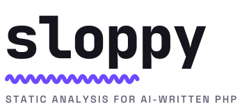
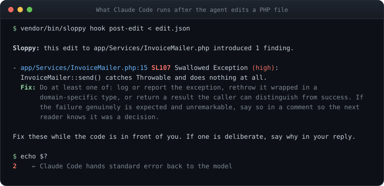
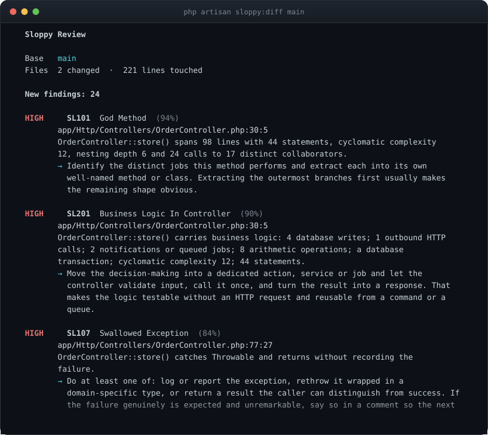

<p align="center">
  <picture>
    <source media="(prefers-color-scheme: dark)" srcset=".github/assets/logo-dark.svg">
    
  </picture>
</p>

<p align="center">
  <b>Your AI agent writes the PHP. Sloppy makes it clean up after itself.</b><br>
  It catches the code people regret — god methods, swallowed exceptions, N+1 queries —
  inside Claude Code, your CI and your Pest suite.<br>
  Deterministic and local: no model, no API key, no network.
</p>

<p align="center">
  <a href="https://github.com/heyosseus/sloppy/actions/workflows/tests.yml"></a>
  <a href="https://packagist.org/packages/heyosseus/sloppy"></a>
  <a href="https://packagist.org/packages/heyosseus/sloppy"></a>
  
  <a href="LICENSE.md"></a>
  <a href="https://ko-fi.com/ratirukhadze"></a>
  <a href="https://m8ven.ai/mcp/heyosseus/sloppy?s=readme"></a>
</p>

<p align="center">
  
</p>

<p align="center"><sub>Real output. Claude Code runs this after every edit and hands it to the model, which fixes the catch block before you ever see it.</sub></p>

## Quick start

```bash
composer require --dev heyosseus/sloppy

vendor/bin/sloppy                   # scan the project (php artisan sloppy in Laravel)
vendor/bin/sloppy agents install    # make Claude Code check its own work
```

That's it: no configuration file, no account. Sloppy finds your source roots
from `composer.json`. It runs on any PHP 8.3+ project, and adds ten
Eloquent-aware rules when it finds Laravel 12 or 13.

A first scan of a codebase with history does not hand you hundreds of findings
to work through. It lists the defects worth fixing first, sums up the rest per
file, and offers to baseline what is already there.

Trying it before adding a dependency? Run `composer global require heyosseus/sloppy`,
or [download the phar](https://github.com/heyosseus/sloppy/releases/latest/download/sloppy.phar).
See [Getting started](docs/getting-started.md).

## How the agent loop works

Agents produce code fast, and they produce the same mistakes fast: the
`catch (Throwable)` that hides a failure, the 200-line controller action, the
query inside a loop. Code review catches them late. Sloppy catches them while
the agent still has the code in hand.

1. **The rules go in first.** `CLAUDE.md` (or `AGENTS.md`, `.cursorrules`,
   Copilot, Windsurf, Laravel Boost) gets this project's rules, each written as
   an instruction the agent can follow.
2. **Every edit is checked.** After each change to a PHP file, Claude Code runs
   Sloppy and hands the model anything *that edit* introduced, then the model
   fixes it.
3. **It can't finish dirty.** When the agent tries to call the task done, new
   findings at or above your threshold send it back to fix them.

It's built never to get in the way. Findings a file already had are never
reported, so the agent doesn't wander off "fixing" code nobody asked it to
touch. The finish check blocks once, so a false positive costs one round trip,
not the session. And if Sloppy can't run (no git, a broken config), the agent
carries on. `sloppy agents uninstall` takes it all back out, leaving every
other setting byte for byte as it was.

There's also an [MCP server](docs/agents.md#mcp-server) for agents that should
scan on demand. See [Coding agents](docs/agents.md).

## What it catches

26 rules, plus two checks that compare your change with its base, and five
more that enforce an architecture you describe. Each one is tested to fire on
the pattern *and* to stay silent on ordinary Laravel code.

| | Rules |
| --- | --- |
| **Complexity** | `SL101` God Method · `SL102` God Class · `SL103` Excessive Nesting |
| **Duplication** | `SL104` Duplicate Logic · `SL111` Copy-Paste Drift, a near-copy whose one difference looks like an unfinished edit |
| **Dead code & dependencies** | `SL105` Dead Private Method · `SL106` Unused Constructor Dependency · `SL112` Placeholder Implementation, the `// ... existing code ...` or "not implemented" left where a body should be |
| **Error handling** | `SL107` Swallowed Exception |
| **Readability** | `SL108` Redundant Condition · `SL109` Narrative Comment · `SL110` Defensive Programming Noise |
| **Laravel** | `SL201` Business Logic In Controller · `SL202` Inline Validation · `SL208` Direct External API Call · `SL209` Model Doing Too Much |
| **Performance** | `SL203` Possible N+1 · `SL204` Query Inside Loop · `SL205` Collection Instead Of Query · `SL210` Suspicious `Model::all()` |
| **Dependencies** | `SL206` Excessive Controller Dependencies · `SL207` Excessive Service Dependencies |
| **Architecture** (advisory) | `SL301` Abstraction Inflation · `SL302` Empty Wrapper Class · `SL303` Single-Use Abstraction |
| **Your architecture** (opt-in) | `SL304` Layer Violation · `SL305` Forbidden Capability, a query in a controller or `env()` in the domain · `SL306` Boundary Violation, one module reaching into another's internals · `SL307` Misplaced Class, a new class with no place in the architecture · `SL308` Role Shape, an action with a second public method |
| **Suppression** | `SL501` Unexplained Suppression · `SL502` Baseline Growth, new entries in your PHPStan or Psalm baseline · `SL503` Weakened Test, a test skipped, stripped of assertions or given `assertTrue(true)` to make it pass |

Every finding says **where** it is, **what** was measured, **how sure** the
analyser is, **why** the pattern costs you, and **what to do** instead. See
[Rules](docs/rules.md), or [write your own](docs/custom-rules.md).

## Beyond the agent

The same analyser, wherever else you want the answer.

**Start with what matters.** A first scan of a medium-sized application finds
hundreds of things, and nobody reads hundreds of things. So `sloppy` lists the
defects first (swallowed exceptions, queries in loops, unfinished bodies),
highest risk first. It sums up the long methods and narrating comments per
file, putting the files that keep changing at the top. Then it tells you which
commands shorten the list without reading it: `sloppy fix` for the mechanical
findings, `sloppy baseline` for the debt that is already there. `--all` lists
everything.

**Review a change.** `sloppy diff main` reports only what your branch
*introduced*, never what it inherited; add `--merge-base` to compare with
where your branch forked, as `sloppy ci` does. `sloppy review main` ranks the same
findings by risk, so you know which file to read first and where to stop.



**Adopt it on a codebase with history.** `sloppy baseline` accepts today's
debt, so only new findings fail the build. Entries are keyed on class and
member, not line numbers, so the baseline survives ordinary editing.

**Gate it in CI.** `sloppy ci` reads the pipeline it runs in: it annotates the
diff on a GitHub pull request and fills the Code Quality widget on GitLab. The
GitHub Action is three lines:

```yaml
- uses: heyosseus/sloppy-action@v1
  with:
    diff-branch: main
```

**Already on PHPStan?** Get the same findings inside the run you already have:

```bash
composer require --dev heyosseus/phpstan-sloppy
```

Each one is a PHPStan error with its own identifier (`sloppy.SL107`), so
`@phpstan-ignore`, `ignoreErrors` and PHPStan baselines work on it. It reports
exactly what `sloppy ci` would fail on. See
[heyosseus/phpstan-sloppy](https://github.com/heyosseus/phpstan-sloppy).

**Fail your tests on new debt.** A Pest plugin ships with the package:

```php
it('has no new slop on this branch', function (): void {
    expectCleanSloppyDiff('main');
});
```

**Fix what a machine can fix.** `sloppy fix` hands the mechanical findings to
Rector, scoped to the files that have them, deletes the comments that only
restate their code, then formats with Pint. It tells you which findings still
need a person, and why no tool should touch them.

**Keep score while you work.** `sloppy watch` keeps the score and what to read
first on screen, redrawing on every save. It's made to sit beside an agent that
is writing code.

**See it where you already look.** Use SARIF for GitHub code scanning and your
IDE, `--format=github` for inline annotations, and Markdown for a PR comment.
There's also a Filament widget, a NativePHP menu-bar label, and
[JSON output](docs/json-output.md) with a published schema.

See [Everyday workflow](docs/workflow.md) and [CI and code scanning](docs/ci.md).

## Why trust the numbers

**It is not an AI detector.** Nobody can reliably tell from source code who or
what wrote it, and Sloppy never tries. It detects patterns that turn into
maintenance cost, whoever wrote them. A 200-line controller action that swallows
a `Throwable` is a problem whether a person or an agent wrote it at 3am.

| Sloppy says | It means | It does **not** mean |
| --- | --- | --- |
| `Confidence: 88%` | How sure the analyser is that the pattern is really there | Any probability that the code was AI-generated |
| `Score: 67/100` | A code-quality risk measure for the analysed paths | "67% of this code is AI-generated" |

**Every number shows its working.** Add `--explain-risk` and each score and risk
prints the arithmetic that produced it. The same code always produces the same
report, which is what makes Sloppy usable as a gate. See
[Score, severity and risk](docs/scoring.md).

**It is tuned for silence.** Rules need several signals, not one; they
understand framework conventions; and they back off wherever code could be
reached indirectly. Sloppy runs over its own source in CI, and a test asserts
that ordinary Laravel code produces zero findings. The rules and the score are
checked against eight open-source Laravel applications, 782,578 lines, where
the four healthiest score 87 to 90.

**It complements your tools rather than replacing them:**

| Tool | Answers |
| --- | --- |
| PHPStan / Psalm | Is this type-correct? |
| Pint / PHP_CodeSniffer | Is this formatted consistently? |
| Pest / PHPUnit | Does this behave correctly? |
| Rector | Can this be transformed mechanically? |
| **Sloppy** | Is this shaped like code somebody will regret? |

If PHPStan can prove it, Sloppy stays out of it.

## Documentation

| | |
| --- | --- |
| [Getting started](docs/getting-started.md) | Install options, every command, your first scan and how a long one is triaged, adopting on an existing codebase |
| [Coding agents](docs/agents.md) | Claude Code hooks, rulesets for every agent, Laravel Boost, the MCP server |
| [Rules](docs/rules.md) | Every rule in detail, and how false positives are kept down |
| [Everyday workflow](docs/workflow.md) | Diff and review, `sloppy fix` over Rector, Pint and narrating comments, Pest expectations, `watch`, Filament and NativePHP |
| [CI and code scanning](docs/ci.md) | `sloppy ci`, the GitHub Action, GitLab, SARIF, annotations, exit codes |
| [Score, severity and risk](docs/scoring.md) | How every number is calculated, and what coverage, git history and PHPStan baselines feed |
| [Configuration](docs/configuration.md) | `config/sloppy.php`, where the binary looks for it, `sloppy-architecture.php`, and taming a noisy first run |
| [JSON output](docs/json-output.md) | The machine-readable report and its contract |
| [Custom rules](docs/custom-rules.md) | Writing your own rule, and where it shows up |

## Roadmap

Still ahead: inline pull-request review comments, `sloppy explain` for a
longer write-up of one finding, HTML reports, and more rules for the shortcuts
agents take, such as configuration keys and routes that do not exist. Anything AI-assisted
will be opt-in and separate: the analyser will always work with no API key, no
network and no model.

## Contributing

Found a false positive? That's a bug worth reporting, not a threshold to work
around. [Open an issue](https://github.com/heyosseus/sloppy/issues). To work on
Sloppy itself, see [CONTRIBUTING.md](CONTRIBUTING.md). `composer test` runs
Rector, Pint, PHPStan at level 8, 100% type coverage and the suite.

Security issues: see [SECURITY.md](SECURITY.md).

## License

MIT. See [LICENSE.md](LICENSE.md).
