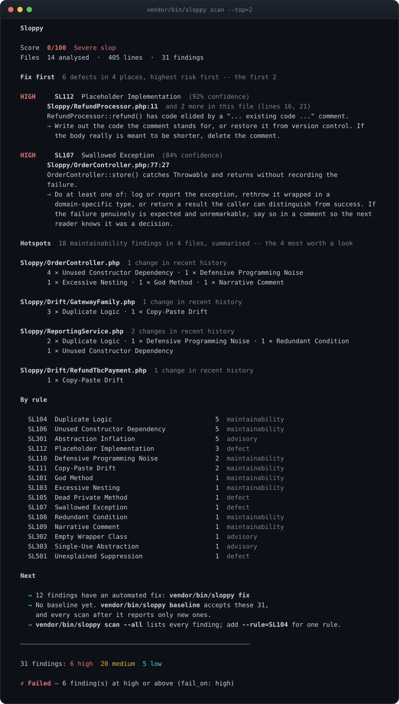
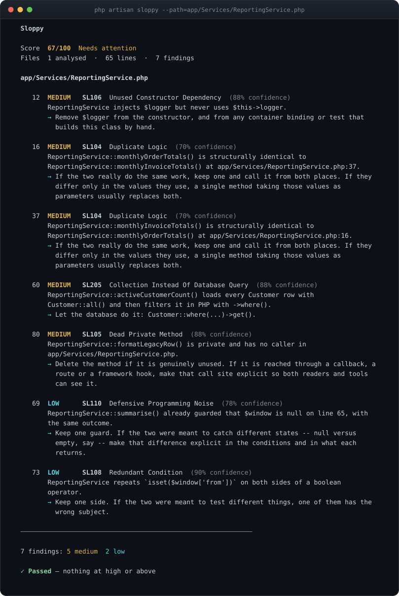
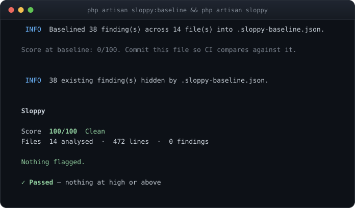

# Getting started

Installing Sloppy, running it for the first time, and turning it on in a project that already has history.

[← Back to the README](../README.md) · [All documentation](README.md)

## Install

```bash
composer require --dev heyosseus/sloppy

php artisan sloppy          # Laravel
vendor/bin/sloppy           # any PHP project
```

The service provider is discovered automatically. Publish the config when you
want to tune it:

```bash
php artisan vendor:publish --tag=sloppy-config
```

### Or without adding a dependency

Deciding whether a tool is worth a `composer.json` entry is easier once you
have seen what it says about your code. Two ways to run it against a project
that has never heard of it:

```bash
# Once per machine, for every project on it
composer global require heyosseus/sloppy
sloppy                                    # run it from anywhere inside a project

# Or a single file, no Composer resolution at all
curl -L -o sloppy.phar https://github.com/heyosseus/sloppy/releases/latest/download/sloppy.phar
chmod +x sloppy.phar
./sloppy.phar
```

Both work with no configuration file. Sloppy finds the project by walking up to
the nearest `composer.json`, and analyses the PSR-4 source roots declared there
when there is no `config/sloppy.php` to say otherwise — so `src/` on a
framework-free project and `app/` on a Laravel one are both found on their own.
Pass `--project` when the directory it picked is not the one you meant.

Everything works this way except the `php artisan sloppy:*` commands
themselves, which need the package installed in the project. `sloppy fix` still
drives Rector and Pint, because it resolves them from the *analysed* project's
`vendor/bin` rather than its own.

Each release attaches `sloppy.phar.sha256` alongside the binary, if you want to
check it:

```bash
curl -L -o sloppy.phar.sha256 https://github.com/heyosseus/sloppy/releases/latest/download/sloppy.phar.sha256
sha256sum -c sloppy.phar.sha256
```

Requirements: **PHP 8.3+**. Laravel 12 or 13 for the Artisan commands and the
`SL2xx` rules; everything else runs anywhere.

## Which command do I want?

```bash
php artisan sloppy:help      # or: vendor/bin/sloppy guide
```

Twelve commands, and the moment each one belongs to. Both names run the same
code, so use whichever your project has.

| Every day | | |
|---|---|---|
| `sloppy` | `sloppy scan` | Analyse the project and rank what is worth reading first |
| `sloppy:diff` | `sloppy diff` | Report what a change introduced, against a git revision |
| `sloppy:review` | `sloppy review` | The same change, ordered by risk rather than by file |
| `sloppy:baseline` | `sloppy baseline` | Accept what is already there, so only new findings fail |
| `sloppy:watch` | `sloppy watch` | Keep the score on screen, redrawing as files change |
| `sloppy:help` | `sloppy guide` | This list |
| **In a pipeline** | | |
| `sloppy:ci` | `sloppy ci` | Analyse a change the way the surrounding CI system reports it |
| `sloppy:fix` | `sloppy fix` | Hand the fixable findings to Rector, then format with Pint |
| `sloppy:health` | `sloppy health` | The score and what is dragging it down, from a cached snapshot |
| **For agents** | | |
| `sloppy:rules` | `sloppy rules` | Write this project's rules into `CLAUDE.md`, `AGENTS.md` and friends |
| `sloppy:agents` | `sloppy agents install` | Hook Sloppy into Claude Code, so it checks every edit and every finish |
| `sloppy:mcp` | `sloppy mcp` | Serve scan, diff, rules and health over MCP |

For one command's options, `sloppy help <command>` or
`php artisan sloppy:<command> --help`.

## Scan a project

```bash
php artisan sloppy                  # the configured paths
php artisan sloppy --path=app/Services
php artisan sloppy --rule=SL101 --rule=SL107
php artisan sloppy --min-confidence=80
php artisan sloppy --explain        # include each rule's "why this matters"
```



That is the command run against a small application written badly on
purpose. It ships as `tests/Fixtures/Sloppy`, so
you can reproduce it.

### Anatomy of a finding

One file, seven findings, the whole report:



Every finding carries the same five things: **where** it is, **what** was
measured, **how sure** the analyser is, **why** the pattern is often a problem,
and **what to do** about it. The last one is the point — a finding you cannot
act on is noise with a line number.

## Adopt on an existing codebase

Turning Sloppy on for the first time should not mean fixing everything first.
Record what is there today, commit the file, and gate on what comes next:

```bash
php artisan sloppy:baseline
```



Baseline entries are keyed on rule, file and a rule-supplied fingerprint —
usually a class and member name — and deliberately **not** on line numbers, so
a baseline survives ordinary editing. If a finding occurs more often than the
baseline recorded, the extra occurrences are new.

`--force` replaces an existing baseline; `--rule=` baselines only some rules.
