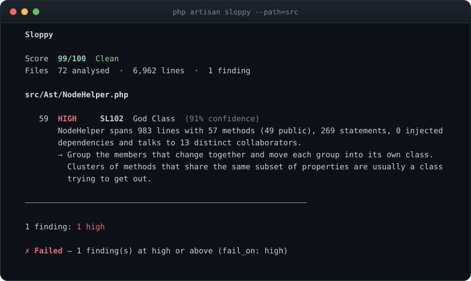

# Rules

Every rule Sloppy ships, and how the rule set is kept quiet on ordinary code.

[← Back to the README](../README.md) · [All documentation](README.md)

## Rules

26 rules ship, plus two diff-only checks (`SL502`, `SL503`) that compare your
change with its base revision, and five more (`SL304` to `SL308`, one of them
diff-only) that join a run only when a project declares its architecture.
Every one has tests proving both that it fires on the pattern and that it
stays quiet on ordinary code.

Two of them target the shortcuts coding agents take to call a task done:
`SL112` catches a body left unwritten, and `SL503` catches a test made to pass
by checking less.

### PHP and general

| ID | Rule | Severity | Category | What it looks for |
| --- | --- | --- | --- | --- |
| `SL101` | God Method | High | Complexity | Methods, functions and property hooks that are excessively long, branchy or chatty across several independent measurements. An anonymous class is measured as itself, not as part of the method that creates it. |
| `SL102` | God Class | High | Complexity | Classes that are large across several dimensions at once: size, method count, injected dependencies and the number of collaborators they talk to. |
| `SL103` | Excessive Nesting | Medium | Complexity | Methods, functions, property hooks and top-level code (a routes file full of closures) whose conditionals, loops and try blocks nest deeper than the configured limit. `else if` counts the same as `elseif`. |
| `SL104` | Duplicate Logic | Medium | Duplication | Methods whose bodies are structurally identical to another method in the project. |
| `SL105` | Dead Private Method | Medium | Dead code | Private methods with no visible caller anywhere in the declaring file. |
| `SL106` | Unused Constructor Dependency | Medium | Dependencies | Constructor-injected dependencies that are never read anywhere in the class. |
| `SL107` | Swallowed Exception | High | Error handling | Catch blocks that neither rethrow, report, log nor otherwise react to the failure they caught. A comment inside the catch that says why the failure is expected (three words or more) lowers it to Low. Looks inside methods, functions, property hooks and top-level closures. |
| `SL108` | Redundant Condition | Low | Readability | Conditions re-tested immediately inside themselves, repeated within one if/elseif chain, duplicated across a boolean operator (anywhere along a chain of `&&` or `||`, but never an operand with side effects such as `$it->next()`), or written as a literal true/false. An inner test counts as a repeat only when the outer one settles it: `$x !== null` does not settle `if ($x)`. |
| `SL109` | Narrative Comment | Low | Readability | Short comments whose every meaningful word already appears in the statement directly below them. An end-of-line comment is about the code to its left and is not judged. |
| `SL110` | Defensive Programming Noise | Low | Readability | A method or function that guards the same subject twice where the second guard can only catch what the first already did (`! $x` after `$x === null` is not reported: it also catches `0` and `''`), with the same outcome, in the same block, and no write to the subject in between -- assignment, destructuring, `foreach` or `catch` variables included. |
| `SL111` | Copy-Paste Drift | High | Duplication | A method body nearly identical to a sibling's, where the one difference looks like an unfinished copy rather than a deliberate variation -- a missing guard, a flipped comparison, the wrong class constructed. Heuristic: the majority is more likely to be right, not automatically right. |
| `SL112` | Placeholder Implementation | High | Dead code | A body that says it is unfinished: an elided-code comment such as `// ... existing code ...`, a body that only throws "not implemented", or a TODO over an empty or constant return (Medium). The thrown message has to be the marker -- `TODO`, `Not implemented`, `stub` -- or lead or end with it; `Cannot stub a final class` is not one. A bare `return [];` never fires on its own — default hooks and null objects do that on purpose. |

### Laravel

| ID | Rule | Severity | Category | What it looks for |
| --- | --- | --- | --- | --- |
| `SL201` | Business Logic In Controller | High | Laravel | Controller actions that combine several business concerns: database writes, calculations, transactions, outbound calls and branching. A write counts only when it is made on a model, a relation or a query -- `$this->service->create()` and `$collection->push()` are not database writes. |
| `SL202` | Inline Validation | Low | Laravel | Large inline validation rule sets inside controllers, where a FormRequest would carry them better. |
| `SL203` | Possible N+1 | Medium | Performance | Relationship access inside a loop where the iterated collection does not appear to eager load that relation -- with `with()`, a column list such as `with('customer:id,name')`, or a `load()` / `loadMissing()` on the collection before the loop. Timestamps (`*_at`) and attributes the model declares in `$casts`, `casts()` or `$dates` are values, not relations. |
| `SL204` | Query Inside Loop | Medium | Performance | Query builder or Eloquent queries executed inside a loop. The collection a `foreach` iterates and a `for` initialiser run once, so they are not inside it. A static call on a class outside the analysed paths counts only when it is a method a model answers with a query. |
| `SL205` | Collection Instead Of Database Query | Medium | Performance | A full table load (`Model::all()`), or a query run to completion with `->get()` (`Model::where(...)->get()`, `Model::query()->get()`), followed immediately by a collection operation the database could have performed. |
| `SL206` | Excessive Controller Dependencies | Medium | Dependencies | Controllers whose constructor injects more collaborators than the configured limit. |
| `SL207` | Excessive Service Dependencies | Medium | Dependencies | Service, action and manager classes whose constructor injects more collaborators than the configured limit. |
| `SL208` | Direct External API Call | Medium | Laravel | Outbound HTTP requests made directly from controllers, models, form requests or middleware -- and from any role whose [architecture policy](configuration.md#policies) forbids `http`. Outbound means the `Http` facade, curl, a remote `file_get_contents()`, or constructing a Guzzle, PSR-18, Symfony or HTTPlug client by its fully qualified name -- not any class named `Client`. |
| `SL209` | Model Doing Too Much | Medium | Laravel | Eloquent models -- including ones that extend a base model of the project's own -- that make outbound calls, dispatch notifications or jobs, or contain long business workflows. |
| `SL210` | Suspicious `Model::all()` | Medium | Performance | `Model::all()` whose result is iterated in the same method (including `foreach (Order::all() as ...)`), or which is called from inside a loop. |

### Architecture

These three are **advisory**. They report that an abstraction is not earning
its keep *for the current usage*, which is a judgement about today's code and
not a rule against repositories or interfaces.

| ID | Rule | Severity | Category | What it looks for |
| --- | --- | --- | --- | --- |
| `SL301` | Abstraction Inflation | Medium | Architecture | Concepts wrapped in several layers where at least one layer is trivial, singly implemented or singly used. |
| `SL302` | Empty Wrapper Class | Medium | Architecture | Classes whose public methods almost all forward their arguments unchanged to a single injected collaborator. |
| `SL303` | Single-Use Abstraction | Low | Architecture | Small interfaces and abstract classes that have exactly one implementation and at most one calling file. Ones that declare nothing at all — Laravel's scaffolded `Controller`, a marker interface — are not reported: there is no signature to duplicate. Enums and anonymous classes count as implementations. |

### Architecture policies

These enforce what a project [declared about its
architecture](configuration.md#describing-your-architecture) -- a preset such
as `hexagonal` or `modular`, or policies of its own. With nothing declared
they are not part of the run, and they are not written into agent rulesets.
They are not advisory: the project asked for them.

| ID | Rule | Severity | Category | What it looks for |
| --- | --- | --- | --- | --- |
| `SL304` | Layer Violation | Medium | Dependencies | A class that names -- extends, implements, injects, instantiates, calls statically, type-hints -- a class its role's policy forbids, by the role that class plays or by a glob on its name (`Illuminate\*`). Reported once per class and target, at the first mention. An allow list (`may_depend_on`) judges only classes that play a role; the role itself is always allowed. |
| `SL305` | Forbidden Capability | Medium | Dependencies | A class that queries or writes the database, dispatches, reads the request or the environment, renders a view or resolves from the container where its role's policy forbids it. Reported once per method and capability. Counts only what is unambiguous: static calls on classes the project index knows are Eloquent models, the `DB`, `View`, `App` and dispatching facades, helpers such as `env()` and `request()`, request parameters, and injected framework types. `$order->save()` on a variable is not counted. Outbound HTTP is reported by `SL208`. |
| `SL306` | Boundary Violation | Medium | Dependencies | A class in one module that names another module's class outside that module's public surface and the shared kernel. |
| `SL307` | Misplaced Class | Low | Dependencies | A class this change adds, in a path the architecture `covers`, that plays no role. Diff mode only, so existing classes are never reported, and it runs only when `covers` is declared. Moving a class to a new name counts as adding it. |
| `SL308` | Role Shape | Low | Dependencies | A concrete class with a public method its role's `public_methods` does not allow (magic methods always are), or one left open in a role whose policy says `final`. Public methods from a trait the analysed paths declare count too, unless the class narrows them (`use T { m as private; }`). Abstract base classes are never judged. |

### Suppression

An analyser or a test being silenced is not a style question. These three are about the
moment somebody decided to stop being told about a problem rather than fix it.

| ID | Rule | Severity | Category | What it looks for |
| --- | --- | --- | --- | --- |
| `SL501` | Unexplained Suppression | Medium | Suppression | `@phpstan-ignore`, `@psalm-suppress`, `@mago-expect`, `@noinspection`, `phpcs:ignore` or `@SuppressWarnings` written with no reason after it. The identifiers a suppression names -- `argument.type, return.type`, `(PHPMD.StaticAccess)` -- are not a reason, and neither is the next docblock tag. Findings are keyed on the method or class they sit in, so a baseline survives code moving. Not suppression *density*: a defended suppression is a reviewed decision, and flagging those would train people to delete the explanation rather than the ignore. |
| `SL502` | Baseline Growth | Medium | Suppression | Entries this change added to `phpstan-baseline.neon` or `psalm-baseline.xml`. Diff mode only — "grew" needs two revisions. Compared per source path, so regenerating a baseline reports nothing. |
| `SL503` | Weakened Test | High | Suppression | Tests this change skipped (`markTestSkipped`, `markTestIncomplete`, Pest's `->skip()` and `->todo()`), stripped of assertions, or gave an assertion that cannot fail (`assertTrue(true)`, `expect(true)->toBeTrue()`; Medium in a brand-new test, which is weak rather than weakened); a deleted test is Medium at 60% confidence. Diff mode only. Tests are compared by name, PHPUnit and Pest alike; assertions made through a helper in the same file still count, and a test renamed or replaced by one that asserts as much is not a deletion. Reads `tests/` and any `*Test.php` — set `rules.SL503.paths` to change that. |

## Does it just complain about everything?

That is the failure mode of every analyser, so Sloppy runs its whole rule set
over its own source in CI:

One finding, and it is a real one: `NodeHelper` is a large class. Splitting it
into five so that rules import three of them to ask three questions would be
exactly the ceremony this package exists to discourage, so the decision is
recorded in `tests/Feature/SelfCheckTest.php` with its reasoning — and that
test fails on any *new* finding about Sloppy's own code. Four others it found
were genuine, and they were fixed.

The other half of the answer is `tests/Fixtures/Good`: deliberately ordinary
Laravel code, with a test asserting that all 26 rules report **zero** findings
on it at a score of 100. The same corpus is run again under a declared
architecture (the `laravel` preset plus a policy, a shape and a module
boundary for every role it contains), where `SL304`, `SL305`, `SL306` and
`SL308` must stay silent too, and added as a change in a git repository with
`covers` on, a shrinking PHPStan baseline and a strengthened test, where the
diff-only `SL307`, `SL502` and `SL503` must stay silent. Each pass is paired
with code that breaks it, so silence is never the rules having nothing to
look at.

## False positives

A static analyser that constantly complains gets switched off, so this is the
priority the whole rule set is tuned around:

- **Multiple signals.** SL101 and SL102 need several independent measurements
  to be over the line, not one. Measurements that move together count once:
  SL101 treats "many calls" and "many collaborators" as one signal, because
  counted separately they carried 41% of its findings on eight real Laravel
  applications. Those were short, flat methods that only delegate.
- **Measured on real code.** Rules are checked against eight open-source
  Laravel applications, 782,578 lines, and what they get wrong there becomes a
  regression test. That is how SL109 learned that a comment at the end of a
  block has no code beneath it to restate, and that one line of a paragraph
  is not a comment on its own.
- **Hedged language.** "Possible N+1", "may be unnecessary for the current
  usage" — where certainty is impossible, the wording says so and the
  confidence drops.
- **Framework awareness.** Relations, scopes, accessors, casts and `boot()`
  hooks are what models are *for*, and are never counted against them. A class
  that exists to make HTTP calls is not flagged for making HTTP calls.
- **Escape hatches everywhere.** Magic methods, dynamic property access,
  attributes, reflection, `compact()`, subclasses — anything that could reach a
  member indirectly makes the relevant rule step back rather than guess.
- **A regression test for silence.** `tests/Fixtures/Good` is ordinary Laravel
  code, and tests assert that every rule reports zero findings on it: the 26
  that always run, the architecture rules under a declared policy, and the
  diff-only checks on a change that adds it. If a change to any rule breaks
  one of those tests, the rule is wrong.

Found a false positive? That is a bug worth reporting, not a threshold to work
around.
