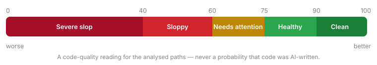

# Score, severity and risk

How every number Sloppy prints is calculated, and which question each one answers.

[← Back to the README](../README.md) · [All documentation](README.md)

## Slop score

A single deterministic number for the analysed paths:

<p align="center">
  
</p>

```text
penalty  = Σ  weight(severity) × confidence / 100
units    = max(1, analysedLines / lines_per_unit)
density  = penalty / units
coverage = min(1, Σ affectedLines / analysedLines)
score    = 100 − min(100, density × penalty_multiplier × (1 + coverage))
```

- Step 1 makes a finding we are half sure about cost half as much.
- Step 2 normalises by codebase size, so a large application is not punished
  merely for being large.
- Step 4 doubles the penalty when findings blanket the codebase and barely
  moves it when they are localised.

Default weights are `critical: 20`, `high: 10`, `medium: 4`, `low: 1.5`,
`info: 0.5`. Weights, the multiplier, `lines_per_unit` and the band thresholds
are all configurable under `sloppy.score`. Same input, same score — always.

Because the score is a density, a small codebase full of findings bottoms out
quickly: the 472-line demo application in
[the scan screenshot](getting-started.md#scan-a-project) scores 0. That
is the arithmetic working, not a verdict on 472 lines of anything.

## Severity and confidence

They answer different questions, and both appear on every finding.

**Severity** — how much this matters if it is real. `critical`, `high`,
`medium`, `low`, `info`. Set by the rule, overridable per rule in config. This
is what `fail_on` compares against.

**Confidence** — how sure the analyser is that the pattern it describes is
actually present, 0–100. A 300-line method is a measurement, so confidence is
high. A possible N+1 depends on eager loading the analyser may not be able to
see, so confidence is lower. Abstraction inflation is a heuristic, so it never
reports above 78.

No rule ever reports 100% confidence. These are heuristics, and a heuristic
that claims certainty is lying.

## Risk

Risk and the slop score answer different questions, and conflating them leads a
team to chase the wrong one.

| | Slop score | Risk |
| --- | --- | --- |
| Question | How is this codebase? | What should I read next? |
| Normalised | Yes, by size | No, absolute |
| Aware of your change | No | Yes |
| Moves a baseline | Yes | Never |

```
risk = severity_weight × (confidence / 100) × novelty × proximity × reach × exposure

reach     = 1 + log10(1 + blast_radius) × reach_weight
novelty   = new 1.0 | inherited 0.25
proximity = inside a changed hunk 1.0 | elsewhere in a touched file 0.3
exposure  = 1 + (1 − coverage) × exposure_weight | 1.0 when no coverage report
```

Every factor defaults to 1.0 when it cannot be measured, which is what makes
the model safe to extend: a project with no coverage report ranks exactly as it
did before `exposure` existed.

**Reach is logarithmic on purpose.** A class with two hundred callers is not
two hundred times more urgent than one with a single caller; the tenth caller
costs less new attention than the first. One usage yields 1.30, ten yields
2.04, a hundred yields 3.00 — a 2.3× spread across two orders of magnitude,
which is roughly the spread a reviewer actually feels.

**A file's risk is the raw sum of its findings, not their density.** A file
with twelve findings should be read before a file with one, even if it is
longer. Density is the right measure for quality and the score already provides
it; total is the right measure for attention.

Every weight lives under `sloppy.risk` and every one is documented in
`config/sloppy.php`. Set `reach_weight` to `0.0` to rank on severity and
confidence alone.

### Show me the arithmetic

Add `--explain-risk` to any command and every derived number prints its own
working:

```bash
vendor/bin/sloppy scan --explain-risk
```

```
    108  HIGH     SL102  God Class  (91% confidence)
         NodeHelper spans 1021 lines with 59 methods…
         → Group the members that change together…
         risk  10.0 (high) × 0.91 (confidence) × 1.00 (novelty unknown) × 1.00 (whole file) × 2.45 (27 usages) = 22.27
```

A tool that weights findings owes you its weights. A number you can watch it
derive is not a magic number.

## Signals from the tools you already run

Sloppy never runs PHPStan, Psalm, Pint or Rector. It reads what they leave
behind and treats it as evidence about a *change* — which is the one thing
those tools cannot do for each other, because none of them knows what changed.

Two rules decide where a signal is allowed to go, and together they are why the
numbers stay comparable:

| | Tracked in git | Not tracked |
| --- | --- | --- |
| Example | `phpstan-baseline.neon` | `build/logs/clover.xml` |
| Same answer on a fresh CI clone? | Yes | No — it exists only after a test run |
| May move the **score**? | Only if also computable from the tree alone | Never |
| May move **risk**? | Yes | Yes |

> **The score is a function of the tree alone.** Anything that needs a second
> revision to compute may be reported and ranked, but never scored.

So `SL501` moves the score — the suppression is sitting there in the file.
`SL502` does not: it exists only relative to a base revision, and scoring it
would make `sloppy scan` and `sloppy diff main` report different scores for the
same working tree. It still counts against `--fail-on`, because a build may
legitimately refuse a change that silenced three errors.

### Coverage

Point Sloppy at a clover or cobertura report and a changed file your tests
never execute rises in the reading order:

```bash
sloppy review main --coverage=build/logs/clover.xml --explain-risk
```

```
4.0 (medium) × 0.85 (confidence) × 1.00 (new) × 1.00 (in hunk) × 1.00 (reach unmeasured) × 1.50 (untested) = 5.10
```

The path can also come from `sloppy.risk.coverage` — it lives in the risk block
because risk is the only thing it feeds — and with neither set Sloppy checks
`build/logs/clover.xml`, `coverage.xml`, `build/coverage/clover.xml`,
`coverage/clover.xml` and `build/logs/cobertura.xml`. Clover and Cobertura are
told apart by content, because CI configurations name these anything at all.

The baseline files `SL502` watches are a rule option, beside `SL501`'s
suppression vocabulary:

```php
'rules' => [
    'SL502' => ['files' => ['phpstan-baseline.neon', 'psalm-baseline.xml']],
],
```

Coverage **never** changes the slop score. A file nobody tested is not a file
with a defect in it; it is a file where a defect would survive, which is a
statement about what to read first.

Coverage reports go stale, and a stale one silently reorders a review. Sloppy
does not guess at that: `sloppy health` and `--explain-risk` print the report's
path and the date it was written, and leave the judgement to you. A staleness
heuristic would be a number that cannot show its arithmetic, which is the one
thing every number in this package can do.

`ext-xml` is suggested, not required. Without it coverage is skipped and
nothing else changes.
